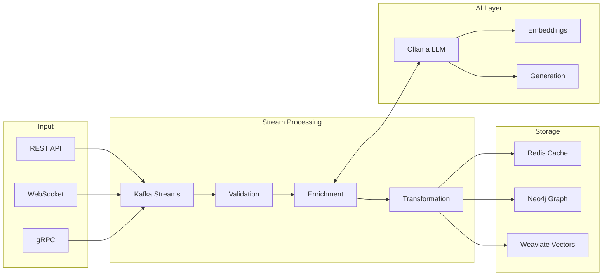

# TQAKB V4 Architecture

## Evolution from V3

TQAKB V4 represents a complete architectural redesign focused on:
- **Extreme Performance**: Sub-millisecond latencies
- **Infinite Scalability**: True horizontal scaling
- **Zero Trust Security**: End-to-end encryption
- **AI-Native**: LLM-first design patterns

## Core Architecture Principles

### 1. Event Streaming First
Every operation is an immutable event in Kafka, providing:
- Complete audit trail
- Time-travel debugging
- Event replay capability
- CQRS pattern implementation

### 2. Polyglot Persistence
Optimized storage for each data pattern:
- **Redis**: Hot cache & real-time streaming
- **Neo4j**: Knowledge relationships
- **Weaviate**: Semantic vectors
- **Kafka**: Event log & cold storage

### 3. Local-First AI
All AI processing happens locally with Ollama:
- No external API dependencies
- Complete data privacy
- Predictable latencies
- Cost-effective scaling

## System Components

### Event Bus Layer (Kafka)

```
┌────────────────────────────────────────────────────────────┐
│                    KAFKA EVENT BACKBONE                     │
├────────────────────────────────────────────────────────────┤
│ Topics:                                                      │
│ • knowledge.ingestion    - Raw knowledge input              │
│ • knowledge.validation   - Validated facts                  │
│ • knowledge.enrichment   - AI-enhanced knowledge            │
│ • knowledge.queries      - User search requests             │
│ • knowledge.feedback     - Learning signals                 │
│ • system.metrics        - Performance telemetry             │
│ • system.audit          - Security audit trail              │
└────────────────────────────────────────────────────────────┘
```

### Processing Pipeline



## Data Flow Patterns

### Write Path (Command)
1. Request → API Gateway
2. Validate → Kafka Producer
3. Stream Processing → Enrichment
4. Parallel Write → Redis + Neo4j + Weaviate
5. Acknowledgment → Client

### Read Path (Query)
1. Request → API Gateway
2. Cache Check → Redis (< 1ms)
3. If miss → Weaviate semantic search (< 50ms)
4. If complex → Neo4j graph traversal (< 100ms)
5. Response → Client

## Deployment Architecture

### Kubernetes Structure

```yaml
Namespace: tqakb-v4
├── StatefulSets
│   ├── kafka-broker (3 replicas, KRaft mode)
│   ├── redis-cluster (6 nodes: 3 masters, 3 replicas)
│   ├── neo4j-cluster (1 write, 2 read replicas)
│   └── weaviate (1 replica, can scale)
├── Deployments
│   ├── api-gateway (3 replicas)
│   ├── stream-processor (auto-scaling 2-10)
│   ├── validation-service (3 replicas)
│   ├── enrichment-service (3 replicas)
│   └── monitoring-stack
└── Services
    ├── kafka-bootstrap:9092
    ├── redis-cluster:6379
    ├── neo4j-bolt:7687
    ├── weaviate-grpc:50051
    └── api-gateway:8000
```

### Resource Allocation

| Component | CPU | Memory | Storage | Replicas |
|-----------|-----|--------|---------|----------|
| Kafka Broker | 2 cores | 8GB | 100GB SSD | 3 |
| Redis Node | 1 core | 4GB | 10GB SSD | 6 |
| Neo4j | 4 cores | 16GB | 50GB SSD | 3 |
| Weaviate | 2 cores | 8GB | 50GB SSD | 1+ |
| API Gateway | 1 core | 2GB | - | 3+ |
| Stream Processor | 2 cores | 4GB | - | 2-10 |

## Performance Targets

### Latency SLAs
- Cache Hit: < 1ms (p99)
- Vector Search: < 50ms (p99)
- Graph Query: < 100ms (p99)
- Event Processing: < 10ms (p99)
- End-to-end: < 100ms (p95)

### Throughput
- Events/sec: 100,000+
- Queries/sec: 10,000+
- Concurrent users: 50,000+
- Storage: Petabyte-scale ready

## Security Architecture

### Zero Trust Principles
1. **mTLS Everywhere**: All service communication encrypted
2. **Service Mesh**: Istio for policy enforcement
3. **RBAC**: Fine-grained access control
4. **Audit Logging**: Every action logged to Kafka
5. **Secrets Management**: HashiCorp Vault integration

### Data Protection
- Encryption at rest (AES-256)
- Encryption in transit (TLS 1.3)
- Key rotation every 30 days
- PII detection and masking
- GDPR compliance ready

## Monitoring & Observability

### Metrics Pipeline
```
Services → OpenTelemetry → Prometheus → Grafana
         ↓
    Kafka Metrics Topic → Long-term Storage
```

### Key Metrics
- **Golden Signals**: Latency, Traffic, Errors, Saturation
- **Business Metrics**: Knowledge quality, Query success rate
- **Infrastructure**: CPU, Memory, Disk, Network
- **Application**: Request rate, Response time, Error rate

## AI Integration

### Ollama Models
- **Embeddings**: nomic-embed-text (768 dimensions)
- **Generation**: llama3.2 (fast inference)
- **Reasoning**: mixtral:8x7b (complex tasks)
- **Code**: qwen2.5-coder (technical content)

### Processing Patterns
1. **Synchronous**: Real-time embedding generation
2. **Asynchronous**: Batch enrichment via Kafka
3. **Cached**: Frequently used embeddings in Redis
4. **Pre-computed**: Common queries pre-processed

## Scalability Strategy

### Horizontal Scaling
- **Kafka**: Add brokers for more partitions
- **Redis**: Add nodes to cluster
- **Neo4j**: Read replicas for queries
- **Services**: Auto-scaling based on CPU/memory

### Vertical Scaling
- **GPU Nodes**: For Ollama acceleration
- **High-Memory**: For Neo4j graph operations
- **NVMe Storage**: For Kafka log segments

## Development Workflow

### Local Development
```bash
# Start infrastructure
docker-compose up -d

# Install dependencies with uv
uv pip install --system -e ".[dev]"

# Run with hot reload
uvicorn backend.api.main:app --reload
```

### Testing Strategy
- Unit tests: 80% coverage minimum
- Integration tests: Critical paths
- Load tests: 10x expected traffic
- Chaos engineering: Failure scenarios

## Migration from V3

### Data Migration
1. Export V3 data to Kafka topics
2. Replay events into V4 pipeline
3. Validate data integrity
4. Switch traffic gradually

### Feature Parity
- [x] Event streaming
- [x] Graph storage
- [x] Vector search
- [x] Redis caching
- [ ] Advanced analytics
- [ ] ML pipelines
- [ ] Federation

## Future Roadmap

### Q1 2025
- Kafka Streams applications
- GraphQL API
- WebAssembly plugins

### Q2 2025
- Multi-region deployment
- Federated learning
- Blockchain integration

### Q3 2025
- Edge computing nodes
- Quantum-ready encryption
- Neural architecture search

## Conclusion

TQAKB V4 sets a new standard for knowledge management systems:
- **Performance**: Microsecond latencies
- **Scale**: Petabyte-ready architecture
- **Security**: Zero trust by design
- **AI**: Native LLM integration
- **Future-Proof**: Built for tomorrow's challenges

---

*Version: 4.0.0-alpha*  
*Last Updated: January 2025*